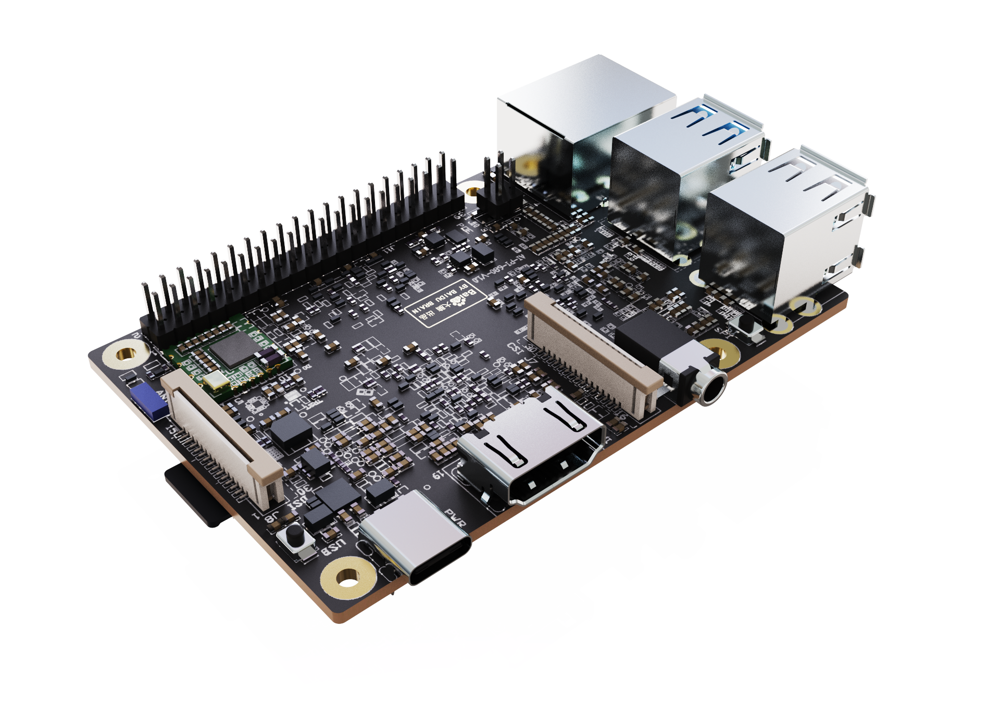
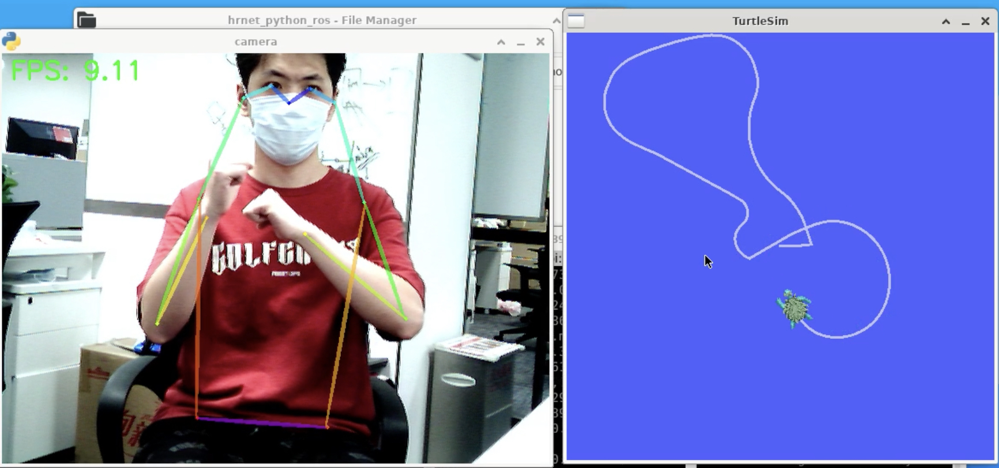
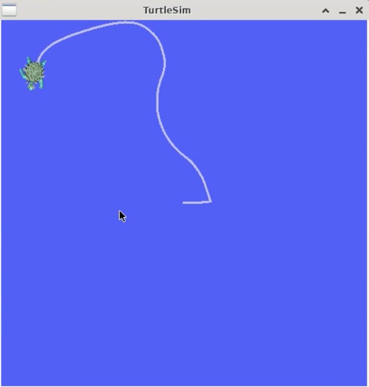
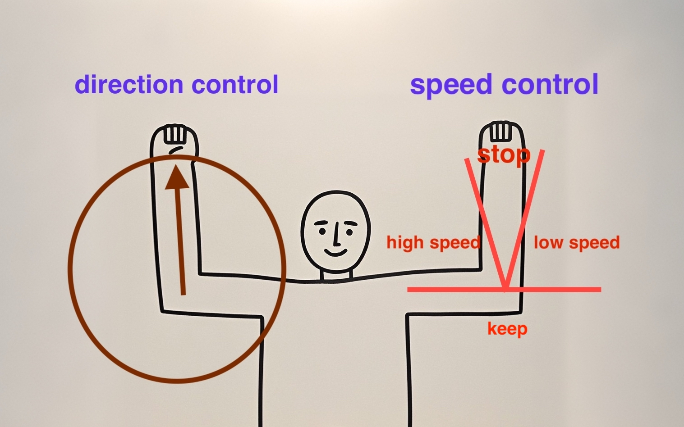

# hornet_ros

# 效果预览



# 环境准备

## step1: 安装ros2 foxy

在终端中输入下面的指令下载，并按照readme要求完成。
```
wget https://pp-os.bj.bcebos.com/vs680/ROSX/dk1a1.2.1-addROSFOXY.zip
unzip dk1a1.2.1-addROSFOXY.zip
```
测试是否安装成功
```
ros2 run turtlesim turtlesim_node
#打开海龟节点

ros2 run turtlesim turtle_teleop_key
#新建终端，打开键盘控制节点
#在终端中可以看到如下控制信息，键盘输入即可开始控制海龟运动
#Use G|B|V|C|D|E|R|T keys to rotate to absolute orientations. 'F' to cancel a rotation.
#'Q' to quit.
```



## Step2: 安装opencv依赖库及EdgeBoard DK-1A推理工具PPNC(如已安装，可跳过此步)

打开终端，执行以下命令安装PPNC。

```
sudo apt update
sudo apt install libopencv-dev -y
sudo apt install python3-opencv -y
sudo apt install ppnc-runtime -y
```

## Step3：安装PaddlePaddle(如已安装，可跳过此步)
打开终端，执行以下命令安装PaddlePaddle。
```
mkdir Downloads
cd Downloads
wget https://bj.bcebos.com/pp-packages/whl/paddlepaddle-2.4.2-cp38-cp38-linux_aarch64.whl  
sudo pip install paddlepaddle-2.4.2-cp38-cp38-linux_aarch64.whl -i https://pypi.tuna.tsinghua.edu.cn/simple
```

## Step4:下载链接

```
git clone https://github.com/HengruiZYP/hrnet_ros.git
```
安装依赖库，确保当前位于/home/edgeboard/hrnet_ros/hrnet_python_ros/src/hrnet_pkg/hrnet_pkg目录下：

```
sudo pip install -r requirements.txt -i https://pypi.tuna.tsinghua.edu.cn/simple
#参数 -i https://pypi.tuna.tsinghua.edu.cn/simple 表示此次使用清华源进行安装。由于网络原因，直接使用默认源安装可能会出现报错。
```

添加环境变量

在 ” .bashrc “ 文件中添加环境变量，这样每次打开终端，都会自动添加ros2的环境变量
```
cd /home/edgeboard/
echo "source /opt/ros/foxy/setup.bash" >> ~/.bashrc   
```

## Step5: 手势控制

在ros2的工作空间下进行
```
cd /home/edgeboard/hrnet_python_ros
#进入到工作空间下
colcon bulid
#编译构建一下
source install/setup.bash
#加载环境变量
```

首先打开海龟节点
```
ros2 run turtlesim turtlesim_node
```

再打开一个终端，用于打开海龟控制节点
```
cd /home/edgeboard/hrnet_python_ros
#进入到工作空间下
source install/setup.bash
#加载环境变量
ros2 run hrnet_pkg turtle_controller
#打开海龟控制节点
```
再次打开一个终端，最后再打开摄像头识别节点
```
cd /home/edgeboard/hrnet_python_ros
#进入到工作空间下
source install/setup.bash
#加载环境变量
ros2 run hrnet_pkg Hrnet_pub --visualize
#打开海龟控制节点
```

控制方式如下，现实生活中，左手用于控制速度，右手用于控制方向


效果如下：


